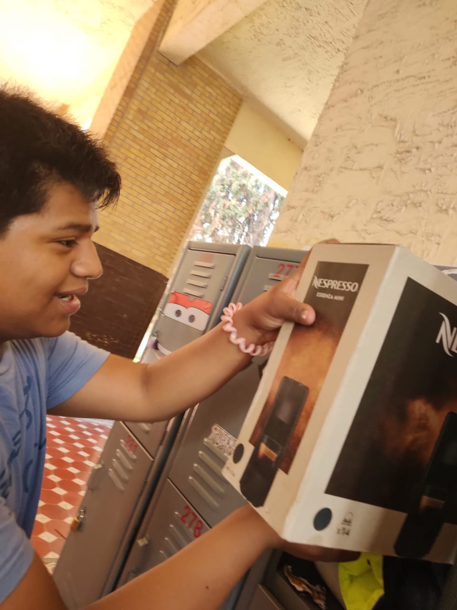
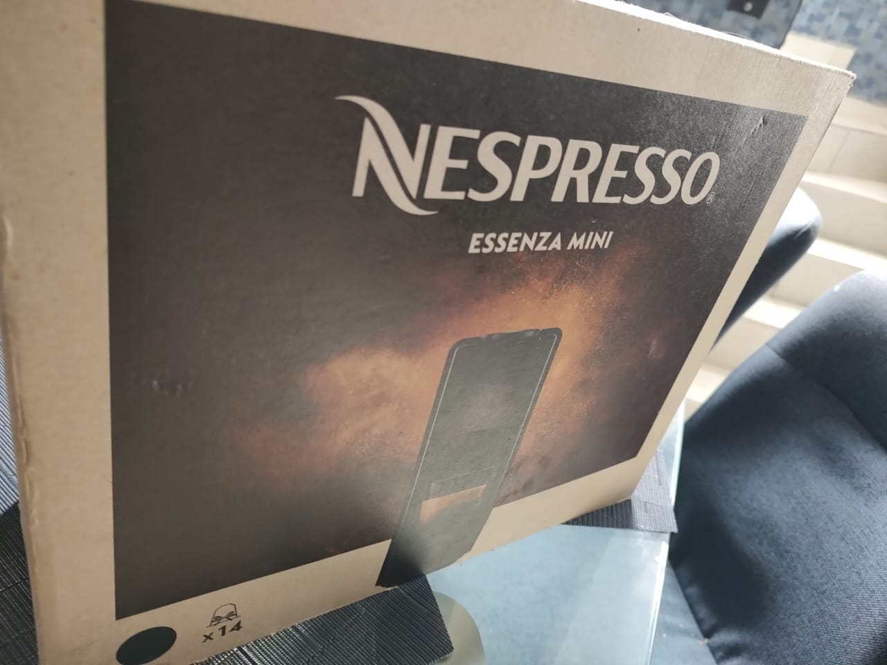
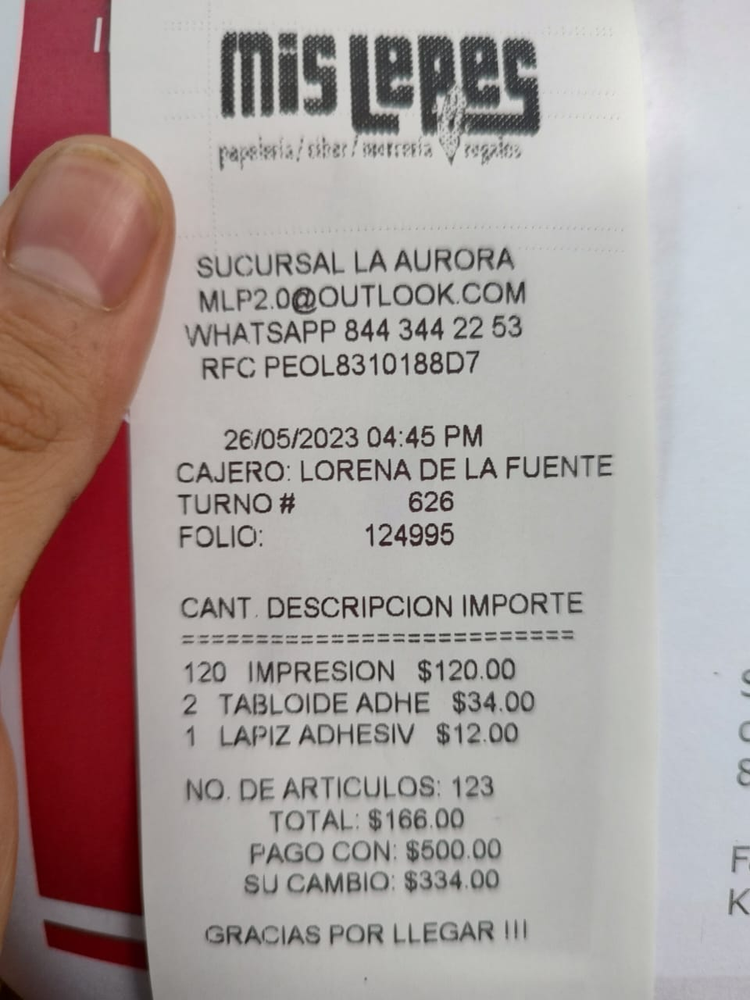

# CARRUSEL DE ALIMENTOS MOSQUETERO

GRUPO 6 KIKAPU​
COMUNIDAD MOSQUETEROS​

- ANTONIO SEBASTIÁN DEL BOSQUE ORTIZ​
- SOFIA CATALINA LÓPEZ GAYTÁN​
- ERICK DANIEL CABELLO CUEVAS

Pudes accesar a nuestra pagina de faceboock [aqui](https://m.facebook.com/groups/828370342132214/?ref=share&mibextid=KtfwRi).

Para ver las horas de cada integrante en el proyecto has click en cada nombre:
 - [Horas de Erick Cabello](https://onedrive.live.com/view.aspx?resid=BD4588C598AA4C1E!6890&cid=bd4588c598aa4c1e&authkey=!ANtvwR0s8OU77TM&CT=1721248786855&OR=ItemsView)
 - [Horas de Catalina Lopez](https://1drv.ms/x/s!Ah5MqpjFiEW9txbpJKt5h3X2M-rz?e=BZg9Oy)
 - [Horas de Sebaastian del Bosque](https://1drv.ms/x/s!Ah5MqpjFiEW9txtbR09GJoTyGvKW?e=xehoUd)

<iframe src="https://onedrive.live.com/embed?resid=BD4588C598AA4C1E%216889&authkey=!AOQpHQzLVNpJj8E" width="320" height="320" frameborder="0" scrolling="no" allowfullscreen></iframe>

# Evidencias varias

- [Panfleto que se uso como difucion](https://1drv.ms/p/s!Ah5MqpjFiEW9tW-GwcU0HZyF84HA?e=9T7DM1)
- [Precentacion del proyecto](https://1drv.ms/p/s!Ah5MqpjFiEW9txndqvQ9wCzXQLar?e=g5keaZ)
- [Video del proyecto](https://onedrive.live.com/embed?resid=BD4588C598AA4C1E%216889&authkey=!AOQpHQzLVNpJj8E)

## Evidencia Fotografica

- 
- 
- 
- 
- 
- 
- 
- 
- 
- 
- 
- 
- 
- 
- 
- 
- 
- 
- 
- 
- 
- 
- 
- 
- 
- 
- 
- 
- 
- 
- 
- 
- 
- 
- 
- 
- 
- 
- 
- 
- 
- 
- 
- 
- 
